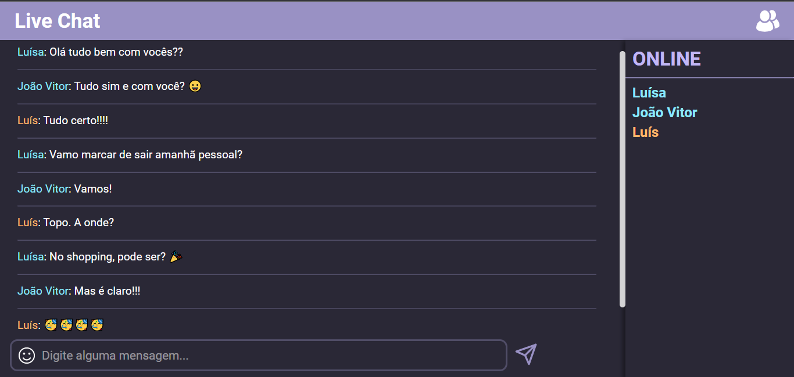

  

:page_with_curl: A simple live chat made with NodeJS and WebSockets 🤖

<h1 align="center">Live Chat</h1>

## Project Status :construction:
- Live Chat | Project complete :white_check_mark:

## Demonstration

## Technologies used :scroll:
- <a href="https://ejs.co/">EJS</a>
- <a href="https://developer.mozilla.org/pt-BR/docs/Web/CSS">CSS</a>
- <a href="https://developer.mozilla.org/pt-BR/docs/Web/JavaScript">JS</a>
- <a href="https://nodejs.org/en/">Node JS</a>
- <a href="https://developer.mozilla.org/pt-BR/docs/Web/API/WebSockets_API">WebSockets</a>

## License :white_check_mark:

- MIT License, <a href="./LICENSE">read more</a>.

luisspassos &copy; 2021.

